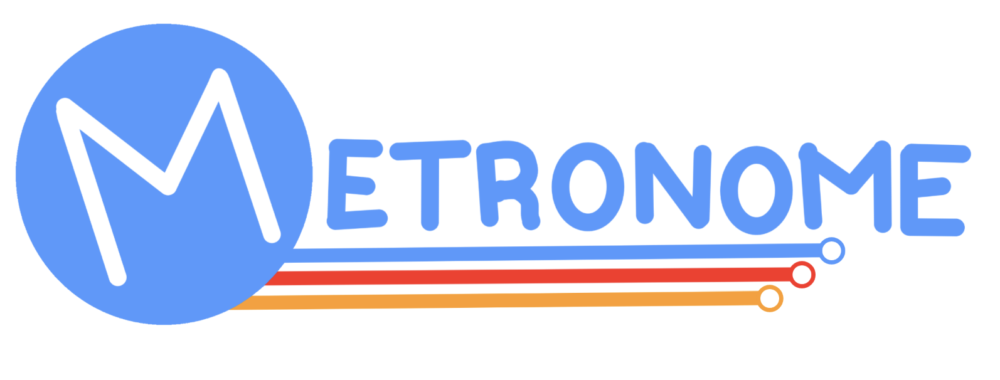
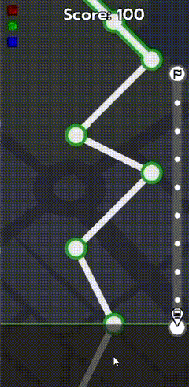
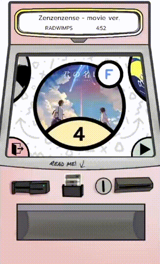
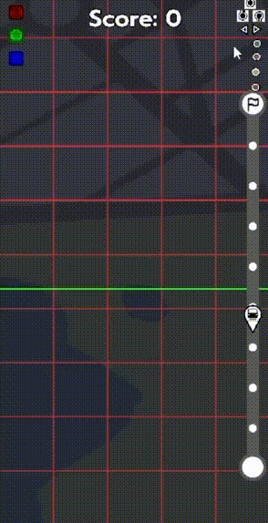
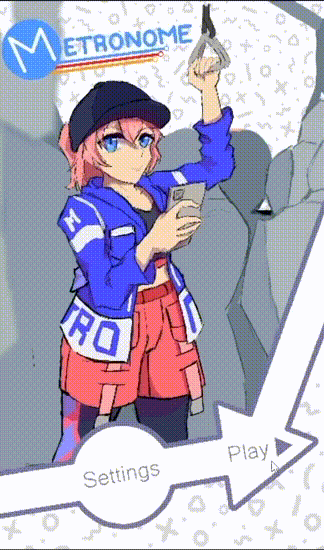

# Metronome

Inspired by Boston MBTA Subway maps, Metronome is a cross-platform rhythm game developed for national competition, combining innovative gameplay mechanics with award-winning artwork and social features.



## Overview

Metronome is a rhythm-based game that challenges players to hit notes in perfect sync with the music. Developed over 3 months by a dedicated full-stack team, the game features innovative social mechanics, polished gameplay systems, and stunning visual design that earned recognition across multiple competition categories.

**Competition Results:**
- 1st Place - Social Experiences
- 1st Place - Gameplay Mechanics  
- 1st Place - Artwork

**Development Period:** January 2024 – April 2024

## Features

<table>
<tr>
<td width="50%">

### Precision Rhythm Mechanics


Hit notes to the music to build combos for score multipliers. 
Scrolls faster/slower with song BPM and map difficulty. Gameplay inspired by the Boston MBTA Subway maps. 

</td>
<td width="50%">

### Interactive Song Select Menu


Swipe the screen to spin through the wide selection of songs! Includes a gameplay manual/tutorial and a title card for songs and their map information.

</td>
</tr>
<tr>
<td width="50%">

### Custom Map Editor


A custom map editor to create maps for any songs you want! Features custom coordinate systems mapped to song BPM and snap-placement for optimal user experience.

</td>
<td width="50%">

### Hand-drawn Artwork


Across the game there is painstakingly hand-drawn artwork to give the game an immersive experience and memorable artstyle.

</td>
</tr>
</table>

## Tech Stack

- **Engine**: Godot 3.5.3 Mono (C#)
- **Programming**: C# (.NET)
- **Graphics**: Adobe Creative Suite (Photoshop, Illustrator, After Effects)
- **Version Control**: GitHub
- **Project Management**: Slack, GitHub Projects
- **Audio**: FMOD, Audacity

## Installation

### Prerequisites
- **Godot Mono 3.5.3** ([Download](https://godotengine.org/download/3.x/))
- **.NET Framework 4.7.2+** or **Mono 6.12+**

### From Release (Recommended)

1. Download the latest release [here](https://github.com/sheepapple/metronome/releases)

2. Extract the archive

3. Run the executable:
   - **Windows**: `Metronome.exe`
   - **macOS**: `Metronome.app`
   - **Linux**: `./Metronome.x86_64`

### From Source

1. **Clone the repository**
```bash
git clone https://github.com/yourusername/metronome.git
cd metronome
```

2. **Install Godot Mono 3.5.3**
   - Download from [Godot's official website](https://godotengine.org/download/3.x/)
   - Make sure to download the **Mono** version (C# support)

3. **Open the project**
   - Launch Godot Mono 3.5.3
   - Click "Import" and navigate to the cloned repository
   - Select `project.godot` file

4. **Build the project**
   - In Godot, go to `Project > Tools > C# > Build Project`
   - Wait for compilation to complete

5. **Run the game**
   - Press F5 or click the "Play" button in Godot editor

## Controls

### Keyboard
- **Arrow Keys / WASD**: Navigate menus, hit notes
- **Space**: Confirm selection
- **Escape**: Pause / Back

### Touchscreen (Android)
- **Use your fingers lmao**

## Awards & Recognition

**National Competition 2024**
- **1st Place** - Social Experiences Category
- **1st Place** - Gameplay Mechanics Category
- **1st Place** - Artwork Category

*Competed against 50+ teams nationwide*

## Development Team (January 2024 - April 2024)

<div><b>Project Lead & UI/UX Development:</b><br/></div>

- [Alex Mizrahi](https://github.com/sheepapple) - Full-stack development, Graphic Design Lead, UI/UX Engineer

<div><b>Lead Gameplay Developers:</b><br/></div>

- [Chang Yang](https://github.com/chyangc) - Lead Gameplay Engineer (Backend)
- [Prakhar Singh](https://github.com/snomkip7) - Lead Gameplay Engineer (Frontend)

<div><b>Artwork, Design, & Publication:</b><br/></div>

- Yang Liu - Lead Artist & Art Director
- Nanqiao Xing - Gameplay Design, Licensing & Distribution, Playtester
- Edwin Lu - Head of Marketing, Playtester

## Contributing

While this was a competition project, we welcome feedback and bug reports!

1. Fork the repository
2. Create a feature branch (`git checkout -b feature/AmazingFeature`)
3. Commit your changes (`git commit -m 'Add some AmazingFeature'`)
4. Push to the branch (`git push origin feature/AmazingFeature`)
5. Open a Pull Request

## Acknowledgments

- Competition organizers and judges
- Godot community for excellent engine support
- My team members for their dedication and hard work
- Playtesters who provided valuable feedback

## Contact & Links

- **GitHub**: [github.com/sheepapple/metronome](https://github.com/sheepapple/metronome)
- **Website**: [sheepapple.net](https://sheepapple.net)

---

**Made possible with my beloved teammates and the Godot Engine <3.**

**Last Updated**: April 2024